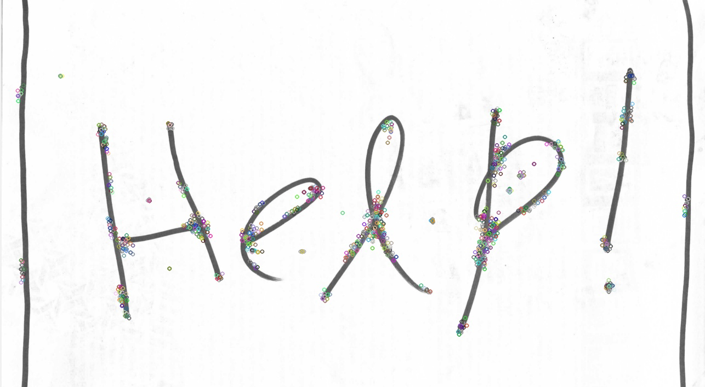
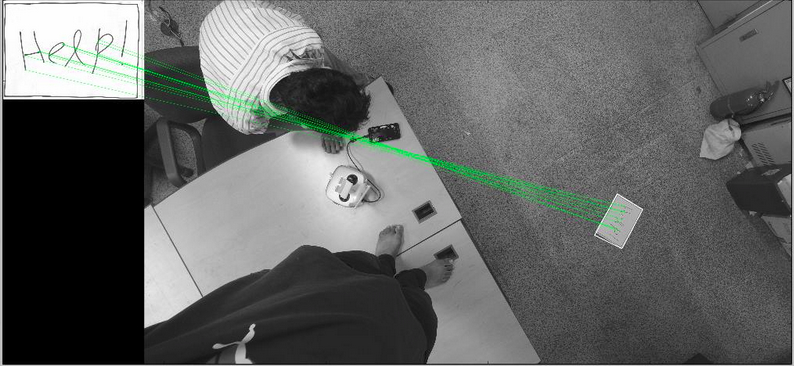

# Autonomous Drone
[Robot Operating System] (http://wiki.ros.org/) (ROS) framework for autonomous landing of a UAV on the target using onboard control. GPS based navigation systems are unsuitable for precision task such as landing therefore computer vision techniques have been used to detect the target accurately and estimate the distance. 

The drone used is [DJI-Matrice] (http://www.dji.com/matrice100). NVIDIA [Jetson-TK1] (http://elinux.org/Jetson_TK1) is used for the onboard control along with a usb camera. 
<p align="center">
  
</p>

##Setting up the hardware
This includes preparing the Jetson TK1 board, activating the drone and setting up a serial communication between them. 
* Flash Jetpack on the board to use all the features of the TK1 board. [Here] (https://www.youtube.com/watch?v=J-ma4aZyqfY) is the video which shows all the steps clearly. 
* Install ROS (Indigo version is used here as it is most compatible with the libraries used) by following the [steps] (http://wiki.ros.org/indigo/Installation/UbuntuARM).
* Install OpenCV on the board. Setup OpenCV 2.4.9 instead of the latest version as it contains the non-free packages as well (SIFT, SURF etc.). Follow this [link] (https://docs.google.com/document/d/1Fk_TDtEYP2b3LLZQTsYia96HplF_5mV7wHlRgcwBHVk/pub).
* Connect the drone to Jetson using UART CANN 2 port and setup a serial communication between the two. Refer to the [Jetson GPIO] (http://elinux.org/Jetson/GPIO) to get the pin number of the I/O ports. [Here] (https://developer.dji.com/onboard-sdk/documentation/hardware-setup/index.html) is the complete hardware setup guide. 
* To use the Onboard SDK feature of Matrice 100 one has to create an app on dji developers website and activate the drone. Steps are mentioned [here](http://forum.dev.dji.com/thread-31786-1-1.html). Download the mentioned DJI_Onboard_SDK_Windows_QT_Sample file from [here](https://github.com/dji-sdk/Onboard-SDK).

##DJI Onboard SDK ROS
This ROS example implements functionality of the DJI Onboard-SDK. It consists of the core library and client packages demonstrating communication with Matrice 100 and A3 flight controllers. Clone the repository into your system and [catkin-make](http://wiki.ros.org/catkin/commands/catkin_make) to compile the libraries. Packages included are:
* dji_sdk
* dji_sdk_demo
* dji_sdk_web_groundstation
* dji_sdk_read_cam
* dji_sdk_dji2mav

Apart from the DJI Onboard SDK packages, two addtional packages have been included which are explained below.
## Detection and Distance Estimation
[This] (src/my_pkg) package is responsible for detection of the target around the UAV and estimating its distance and generating control signals accordingly to maneuver the drone to the location precisely. This package has been divided into two parts:

**SIFT features**

[This] (src/my_pkg/src/tutorial_package/test.py) Python file contains the algorithm to detect the target in the image acquired from camera and estimate the distance from the drone. The algorithm is based on the [SIFT](http://opencv-python-tutroals.readthedocs.io/en/latest/py_tutorials/py_feature2d/py_sift_intro/py_sift_intro.html) feauture extraction method included in the OpenCV library. When applied on an image, this method identifies and stores the keypoints in the input image. Each keypoint is assigned a 128 elements long unique descriptor vector. For example here keypoints are extracted in this image which is used as the landing mark for the drone. This image will play the role of the training image.

<p align="center">
  
</p>

Now features of the input image from the camera of the drone are extracted and stored.

<p align="center">
  
</p>

Finally the features from both the images (input image used here is different from the one used above) are matched and the target is identified. This feature matching is done through a Euclidean-distance based nearest neighbor approach.

<p align="center">
  
</p>

Now when the target has been identified in the input image, distance can be estimated using the basic principles of cartesian geometry.

1. Calculate the mean of all the matched feature points (x and y coordinates separately). This will approximately give the point at the centre of the landing mark.
2. Position of the drone can be approximated as the centre of the image as the camera is facing vertically downwards.
3. Using the distance formula between two coordinates on a horizontal plane separation between the drone and the target can be estimated. **We don't have to worry about the vertical distance of the drone from the ground as the drone itself keeps the record of that**.

**Maneuvering the drone**

After calculating the distance in the x and y directions, task is to maneuver the drone to the desired location and land safely. [This] (src/my_pkg/src/tutorial_package/client.py) Python file uses the pre-defined libraries of DJI Onboard SDK to perform mentioned tasks. The distance in the x and y directions calculated above are used here to guide the drone in [attitude mode](http://wiki.dji.com/en/index.php/Control_Mode#Attitude_Mode).

## Image Acquisition

It is required to get the image from the camera mounted on the drone and give it to the vision algorithm so that it could calculate the distance of the target from the drone. For this purpose a combination of packages is used. To convert the image from the camera into the format compatible with ROS (ROS image) [usb_cam] (http://wiki.ros.org/usb_cam) package is used.
```bash
sudo apt-get install ros-indigo-usb-cam
```
To use the ROS image with the OpenCV cv_bridge library has to be included into the manifest file of the rospy package. [Here](http://wiki.ros.org/cv_bridge/Tutorials/ConvertingBetweenROSImagesAndOpenCVImagesPython) is an example that listens to a ROS image message topic, converts the images into an IplImage, draws a circle on it and displays the image using OpenCV. The image is then republished over ROS. 

[This](src/my_pkg1/src/tut_pkg/cam.py) python code implements this and converts the image from camera into ROS image which is further converted into OpenCV image and given to the vision algorithm.

## Conclusion
The above framework was experimented at a height of 3 and 5 meters above the ground and worked well except when wind currents were strong which gave error due to small size of the landing platform (A4 sheet). DJI onboard SDK provides control over drone in both GPS and non-GPS modes and can be used according to the scenario in which drone is to be used. Have a look at the [dji_sdk_demo] (src/dji_sdk_demo/script/client.py) to get the feel of all the control commands available.
