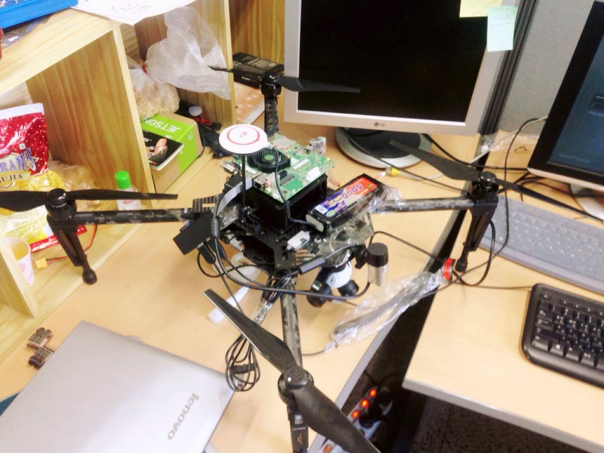

# Autonomous Drone
[Robot Operating System] (http://wiki.ros.org/) (ROS) framework for autonomous landing of a UAV on the target using onboard control. GPS based navigation systems are unsuitable for precision task such as landing therefore computer vision techniques have been used to detect the target accurately and estimate the distance. 

The drone used is [DJI-Matrice] (http://www.dji.com/matrice100). NVIDIA [Jetson-TK1] (http://elinux.org/Jetson_TK1) is used for the onboard control along with a usb camera. 

  

##Setting up the hardware
This includes preparing the Jetson TK1 board, activating the drone and setting up a serial communication between them. 
* Flash Jetpack on the board to use all the features of the TK1 board. [Here] (https://www.youtube.com/watch?v=J-ma4aZyqfY) is the video which shows all the steps clearly. 
* Install ROS (Indigo version is used here as it is most compatible with the libraries used) by following the [steps] (http://wiki.ros.org/indigo/Installation/UbuntuARM).
* Install OpenCV on the board. Setup OpenCV 2.4.9 instead of the latest version as it contains the non-free packages as well (SIFT, SURF etc.). Follow this [link] (https://docs.google.com/document/d/1Fk_TDtEYP2b3LLZQTsYia96HplF_5mV7wHlRgcwBHVk/pub).
* Connect the drone to Jetson using UART CANN 2 port and setup a serial communication between the two. Refer to the [Jetson GPIO] (http://elinux.org/Jetson/GPIO) to get the pin number of the I/O ports. [Here] (https://developer.dji.com/onboard-sdk/documentation/hardware-setup/index.html) is the complete hardware setup guide. 
* To use the Onboard SDK feature of Matrice 100 one has to create an app on dji developers website and activate the drone. Steps are mentioned [here](http://forum.dev.dji.com/thread-31786-1-1.html). Download the mentioned DJI_Onboard_SDK_Windows_QT_Sample file from [here](https://github.com/dji-sdk/Onboard-SDK).
